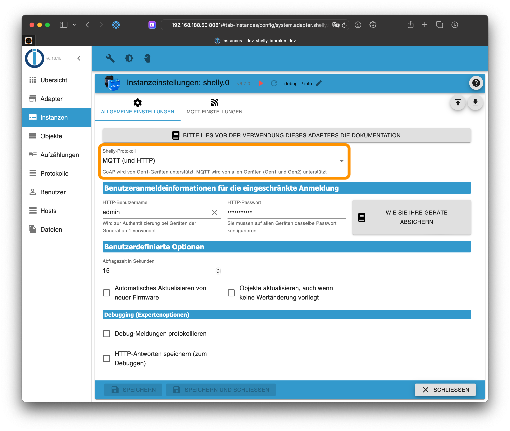
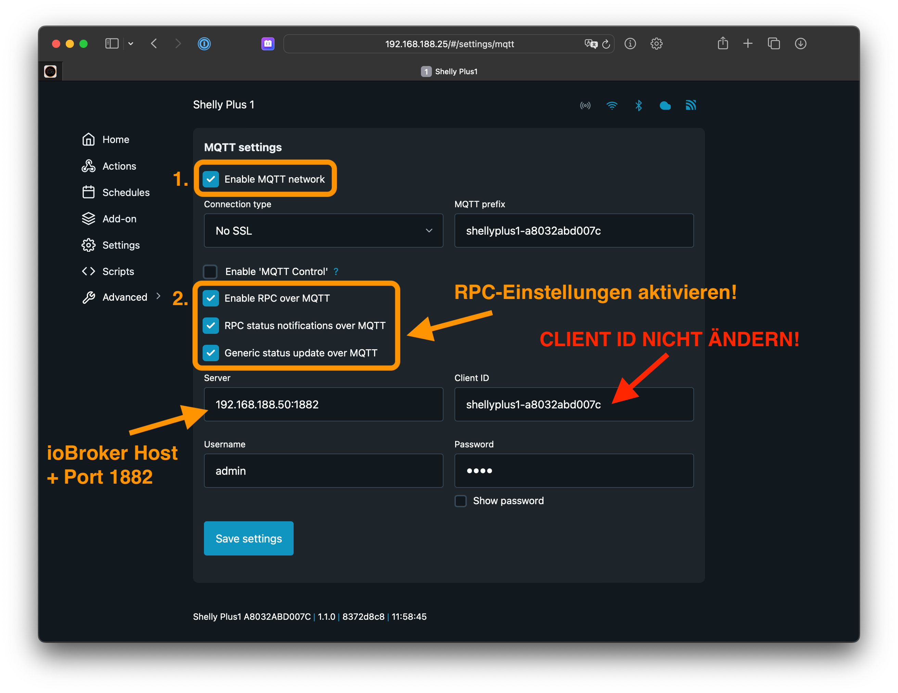

# ioBroker.shelly

## MQTT



### Wichtige Hinweise

- Es ist nicht möglich, den Shelly-Adapter mit einem existierenden MQTT-Broker in deinem Netzwerk zu verbinden
- Der Shelly-Adapter startet einen eigenen MQTT-Broker, welcher auf dem Port ``1882`` gestartet wird, um einen Konflikt mit anderen MQTT-Brokern auf dem gleichen System zu vermeiden (Standard-Port für MQTT ist 1883)
- Es ist nicht möglich, einen MQTT-Client (wie MQTT-Explorer) gegen den internen MQTT-Broker zu verbinden
- Der Standard-Port des MQTT-Brokers kann in der Konfiguration des Adapters angepasst werden
- **Es ist kein Wissen über das MQTT-Protokoll erforderlich** - sämtliche Kommunikation wird intern behandelt

### Konfiguration

1. Öffne die Shelly-Adapter Konfiguration im ioBroker
2. Wähle ```MQTT (und HTTP)``` als *Protokoll* in den *Allgemeinen Einstellungen*
3. Öffne das Tab **MQTT Einstellungen**
4. Wähle einen Benutzernamen und ein sicheres Passwort (Du musst diese Informationen auf allen Shelly-Geräten hinterlegen)


Aktiviere MQTT auf deinen Shelly-Geräten.

### Generation 1 Geräte

1. Öffne die Shelly-Webkonfiguration in einem Browser (nicht in der Shelly App!)
2. Gehe zu ```Internet & Security settings -> Advanced - Developer settings```
3. Aktiviere MQTT und gib die gerade konfigurierten Benutzerdaten und die IP-Adresse deiner ioBroker-Installation ein - gefolgt vom konfigurierten Port (beispielsweise ```192.168.1.2:1882```)
4. Speichere die Konfiguration - der Shelly startet automatisch neu

- **Ändere nicht den ```(custom) MQTT prefix``` - der Adapter funktioniert nicht, wenn Du diesen Wert anpasst!**


### Generation 2 Geräte (Plus und Pro)

1. Öffne die Shelly-Webkonfiguration in einem Browser (nicht in der Shelly App!)
2. Gehe zu ```Networks -> Mqtt```
3. Aktiviere MQTT und gib die gerade konfigurierten Benutzerdaten und die IP-Adresse deiner ioBroker-Installation ein - gefolgt vom konfigurierten Port (beispielsweise ```192.168.1.2:1882```)
4. Speichere die Konfiguration - der Shelly startet automatisch neu

- **Ändere nicht die "client id" in dieser Konfiguration**
- **Für Generation 2 Geräte müssen alle RPC-Optionen aktiviert werden (siehe Screenshot)!**
- SSL darf nicht aktiviert werden


