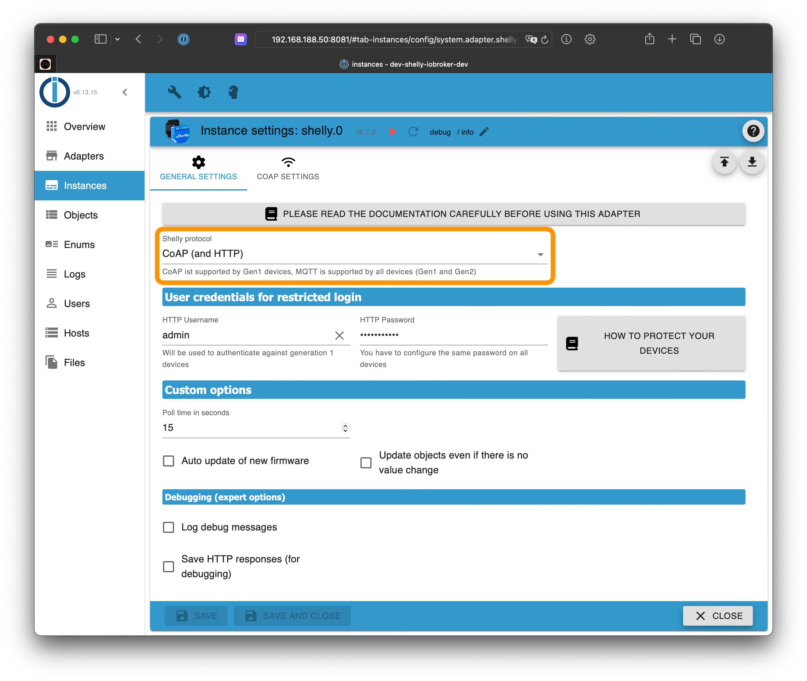
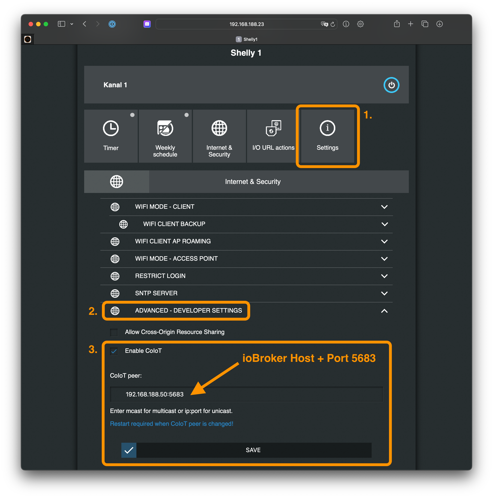
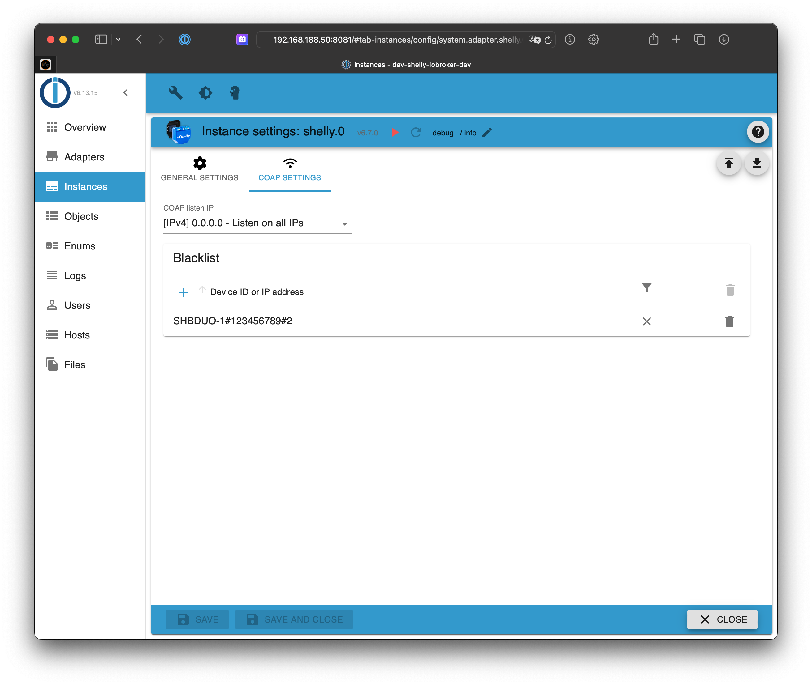

# ioBroker.shelly

## CoAP



The CoAP protocol is used by default.

**If you are using the firmware versions above 1.9.4 you have to enter a CoIoT server for CoAP on your Shelly device (unicast).**

Enter the IP address of your ioBroker server as CoIoT server - followed  by port ```5683```. Example: If ioBroker runs on address ```192.168.1.2```, you have to enter ```192.168.1.2:5683``` and activate CoIoT.



CoAP will add all devices in your network. If you want to exclude some Shelly devices, you can put them on a blacklist. Just enter the serial numbers to the blacklist table:



### Older firmware versions

If you use Shelly devices with firmware version 1.9.4 (or older) you don't have to configure anything. Your Shelly devices will be discovered by ioBroker automatically.

**Important: Because CoAP use multicast UDP packages, the Shelly devices has to be in the same subnet as your ioBroker server.**

### Important notes

#### Docker

If you use ioBroker in a docker container, the container has to run in network mode ```host``` or ```macvlan```. If the docker container is running in ```bridge``` mode, your Shelly devices will not be found.

#### Shelly Firmware 1.8.0 (or later)

- If you use the CoAP protocol, you have to use adapter version 4.0.0 or above.
- If you use devices with firmware below 1.8.0 (except Shelly 4 Pro) you have have to use adapter version 3.3.6 or below. The adapter version 4.0.0 (or later) would not work in this case!

#### Shelly Firmware 1.9.4 (or later)

- You have to enter a CoIoT server for CoAP (unicast).
