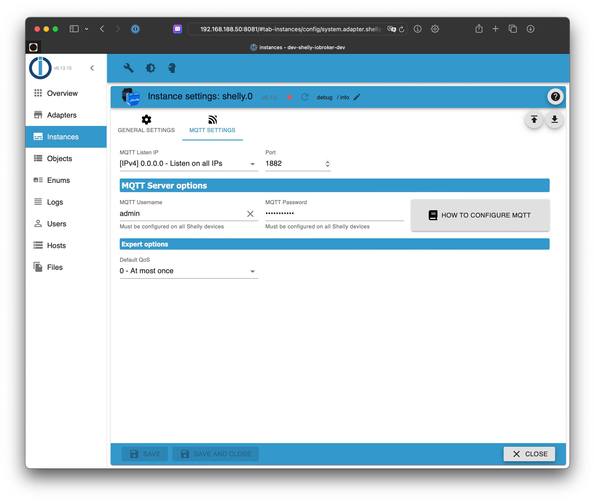

# ioBroker.shelly

## MQTT


### Important notes

- It is not possible to connect the Shelly adapter to an existing MQTT broker in your network
- The Shelly adapter starts an own MQTT broker which is running on the (non default) port ``1882`` to avoid conflicts with other MQTT brokers on the same system (the default port for MQTT is 1883)
- It is not possible to connect a MQTT client (like MQTT-Explorer) to the internal MQTT broker
- You can change the port of the MQTT broker in the adapter settings
- **You don't need any knowledge about MQTT to use it** - everything is handled internally

### Configuration

1. Open the Shelly Adapter configuration in ioBroker
2. Choose ```MQTT and HTTP``` as *protocol* in the *general settings*
3. Open the **MQTT Settings** tab
4. Choose a username and a secure password (you have to configure these information on all Shelly devices)



Activate MQTT on all your Shelly devices.

### Generation 1 devices

1. Open the Shelly web configuration in your webbrowser (not in the Shelly App!)
2. Go to ```Internet & Security settings -> Advanced - Developer settings```
3. Enable MQTT and enter the previously configured username, password and the ip address of your ioBroker installation - followed by the configured port (e.g. ```192.168.1.2:1882```)
4. Save the configuration - the Shelly will reboot automatically

- **Do not change the ```(custom) MQTT prefix``` - the adapter will not work if you change the prefix!**


### Generation 2 devices (Plus and Pro)

1. Open the Shelly web configuration in your webbrowser (not in the Shelly App!)
2. Go to ```Networks -> Mqtt```
3. Enable MQTT and enter the previously configured username, password and the ip address of your ioBroker installation - followed by the configured port (e.g. ```192.168.1.2:1882```)
4. Apply the configuration - the Shelly will reboot automatically

- **Do not change the "client id" in this configuration**
- **You have to enable all RPC notification options for gen 2 devices (see screenshot)!**
- SSL has to be disabled!


